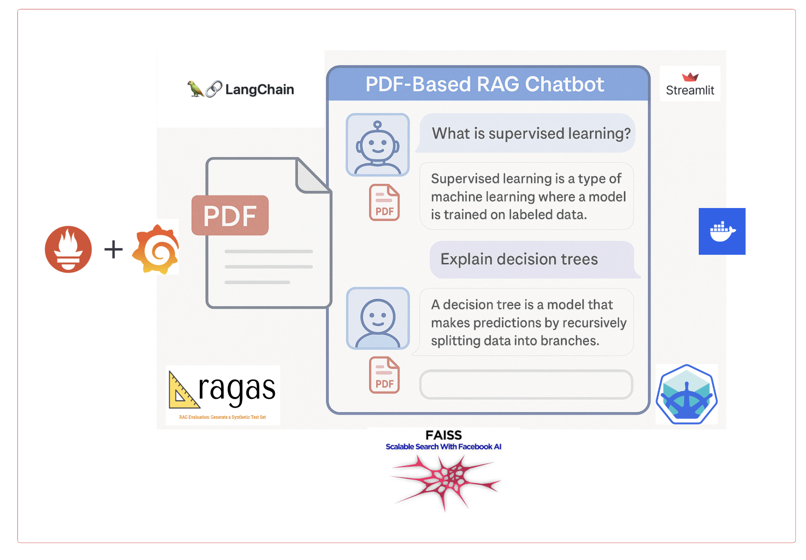

## Local installation and testing
1. `pip install pip-tools`
2. `pip install -r requirements/requirements.in`
3. `pip install -r requirements/requirements.txt`

**Ensure you have your OPENAI_API_KEY, LANGSMITH in `.env` file**
1. `python vector_loader.py`
2. `streamlit run streamlit_apply.py`


# Deployment

## Deployment script (Minikube)
Before running this script, ensure that you have both `minikube` and `Docker` on your system.
1. `minikube start`
2. `docker build -t test_image .` : Build image locally
3. `minikube image load test_image`
4. `kubectl apply -f deployment.yaml`
5. `kubectl apply -f service.yaml`

 You can test the running status of pods and the container using `k9s`


## Testing
1. `kubectl expose deployment my-app --type=NodePort --port=8501`: Expose the service port
2. `minikube service my-app --url` and click on the url / it will generate url like: `http://127.0.0.1:49154`
3. `curl <url>` / click on url on local machine


# Monitoring Setup

## Grafana and Prometheus: Install using helm
- `helm repo add prometheus-community https://prometheus-community.github.io/helm-charts`
- `helm repo update`
- username: `prom-operator` (password: `admin`)
- `helm install monitoring prometheus-community/kube-prometheus-stack -f values.yaml`
- `prometheus --config.file=prometheus.yaml`


```
NAME: monitoring
LAST DEPLOYED: Mon May 26 17:34:47 2025
NAMESPACE: default
STATUS: deployed
REVISION: 1
NOTES:
kube-prometheus-stack has been installed. Check its status by running:
  kubectl --namespace default get pods -l "release=monitoring"

Get Grafana 'admin' user password by running:

  kubectl --namespace default get secrets monitoring-grafana -o jsonpath="{.data.admin-password}" | base64 -d ; echo

Access Grafana local instance:

  export POD_NAME=$(kubectl --namespace default get pod -l "app.kubernetes.io/name=grafana,app.kubernetes.io/instance=monitoring" -oname)
  kubectl --namespace default port-forward $POD_NAME 3000

Visit https://github.com/prometheus-operator/kube-prometheus for instructions on how to create & configure Alertmanager and Prometheus instances using the Operator.
```

**Metrics**
- LLM Query Rate (per second)
- LLM Query Latency
- LLM Error Queries 
- LLM Total Queries
- LLM Average Query Latency
- LLM Error Queries


## LLM Monitoring and Tracing
1. Langchain Tracing (Langsmith): Ensure you have added your langsmith API key and tracing setup in `.env` file.


## Assumptions
- Retreival on only one document
- English Language
- User doesn't ask questions on the responses
- Size of the document is small. If that's not the case, some recommendations on it 


# Performance Optimization


## Improved Retreival and Ranking
- Memory of chatbot (conversational aware) [Implemented]
- Hybrid retreival (Keyword + Dense): https://python.langchain.com/docs/how_to/multi_vector/ [Implemented]
  - BM25 + FAISS 
- Calling the FAISS DB once and not every time we are querying  (remove redundancy)
- Building the FAISS index ourself and not using defaults [TODO]
- Error handling with FAISS DB
- Add alerts if no documents are retreived by the LLM. In production, integrate it with PagerDuty or Slack [TODO]
- Improved embedding [TODO]
  - properietary
  - open source:
      - BAAI/bge-base-en-v1.5 
      - sentence-transformers/all-MiniLM-L6-v2 


### Vector DB
- Promt design 
  - Explicit instructions
  - Prevent hallucinations on the responses
- issue with basic vector data: 
  - FAISS: fine-tune with k results and add a threshold
  - With small vectors, we can use IndexFlatL2 index. However, as the size of document grows, vectors scale up as well. If vector size reaches in the order of millions, then we should should other indexing approach such as Inverted File Index (IndexIVFFlat / IndexIVFPQ)
  - in-memory store, so slow as dataset size grows
  - not caching of frequent queries
  - no support for hybrid search
  -
- shift to Distributed vector database: Weviate DB and deploy to cloud
- 

- Try different chunking strategies [TODO]
- Query expansion or rewrite with or LangChain’s QueryConstructor [TODO]


- conversational RAG with history aware retreiver


- LangGraph for production use-case [TODO]


## Scalability of the chatbot with large number of users
- Managing chat history and multiple documents with SQLite [Implemented]
  - `Application_logs`: stores chat history and model responses
  - `document_store`: keep tracks of uploaded documents


## Evaluation of RAGs output
- RAGAS to compute precision, answer relevancy and context [Impemented]
- LLM as judge [TODO]