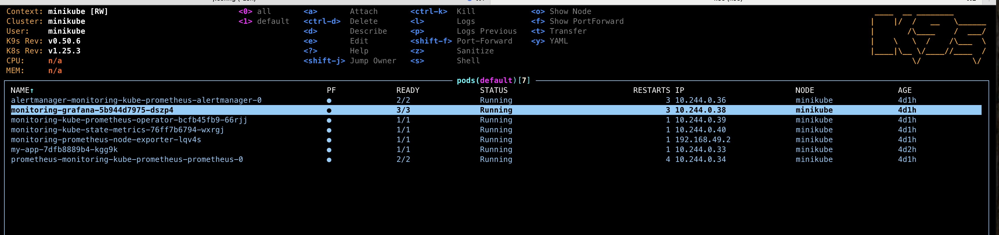

pip install -r requirements/requirements.in
pip install -r requirements/requirements.txt

## Local installation

**Ensure you have your OPENAI_API_KEY in `.env` file**
1. `python vector_loader.py`
2. `strealit run streamlit_apply.py`

# Deployment
## Deployment script (Minikube)
Before running this script, ensure that you have both `minikube` and `Docker` on your system.
1. `minikube start`
2. `docker build -t test_image .` : Build image locally
3. `minikube image load test_image`
4. `kubectl apply -f deployment.yaml`
5. `kubectl apply -f service.yaml`

 You can test the running status of pods and the container using `k9s`

## Testing
1. Expose the service port: kubectl expose deployment my-app --type=NodePort --port=8501`
2. `minikube service my-app --url` and click on the url

# Monitoring Setup

# Performance Optimization